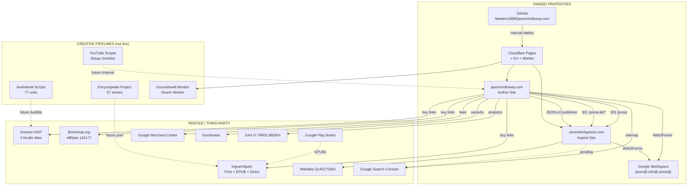
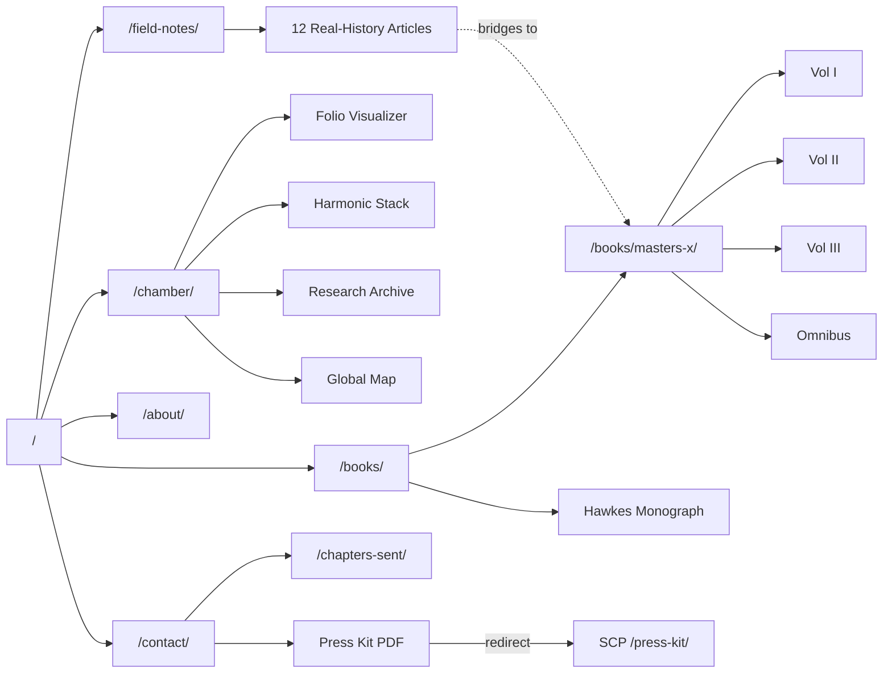
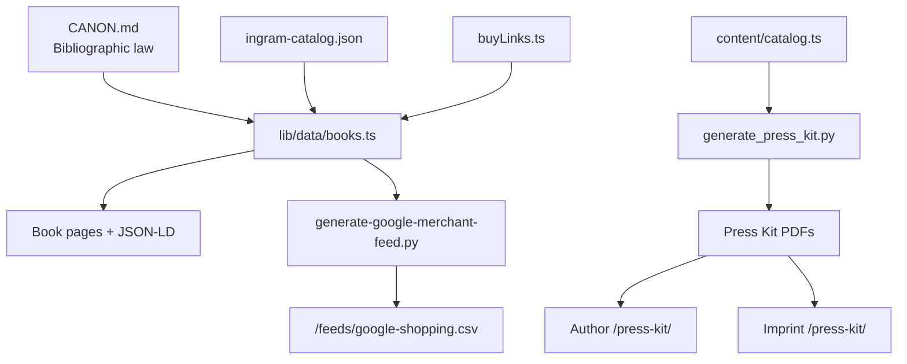
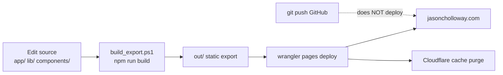
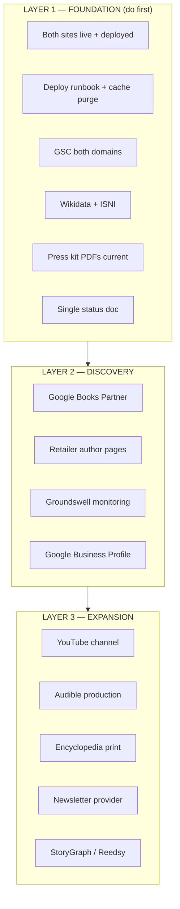

# Connections Diagram — Yarn-on-the-Wall View
**Purpose:** Visual map of how everything connects. Paste Mermaid blocks into any renderer (Notion, GitHub, Claude artifacts).

---

## Master ecosystem (top level)

---

## Author site internal web

---

## Data flow (canonical sources → outputs)

---

## Deploy pipeline (critical — manual)

---

## Retail connection matrix

| Edition | IngramSpark Direct | Amazon | Bookshop | Google Play | Merchant Feed |
|---------|-------------------|--------|----------|-------------|---------------|
| Vol I PB/HC/EPUB | Yes | Kindle only | ISBN search | EPUB | PB+HC |
| Vol II PB/HC/EPUB | Yes | Kindle only | ISBN search | EPUB | PB+HC |
| Vol III PB/HC/EPUB | Yes | Kindle only | ISBN search | EPUB | PB+HC |
| Omnibus PB/HC | Yes | No | List link | No | PB+HC |
| Hawkes PB/HC/EPUB | Yes | No | — | EPUB | PB+HC |

---

## Foundation vs. expansion layers

---

## Thumbtack legend (for physical wall map)

If you want to replicate this on a physical board:

| Color | Meaning |
|-------|---------|
| Blue | Owned web property |
| Green | Live third-party account |
| Yellow | WIP / pipeline (not public) |
| Red | Open debt / verify needed |
| Gray | Retired / historical |

**Yarn types:**
- Solid line = active link (redirect, buy link, JSON-LD)
- Dashed line = planned / WIP connection
- Red yarn = broken or stale connection
