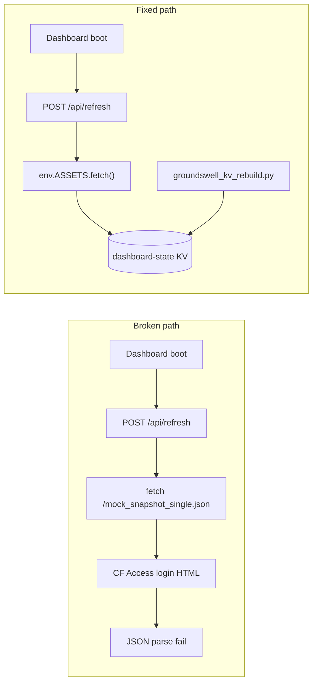

# Groundswell Dashboard Fix — 2026-08-09

**Agent:** Morgan (Groundswell wiring)  
**Live dashboard:** https://groundswell-monitor.zh5779485.workers.dev/  
**KV namespace:** `6f0e96702c3d4da4ad652abd51b5d82e` · key `dashboard-state`

---

## Executive summary

Analytics looked “dead” because **Worker KV held almost no traffic/social/terms data** and **`/api/refresh` could not merge the committed snapshot** on dashboard load. Root cause: refresh fetched `/mock_snapshot_single.json` via public HTTP, which **Cloudflare Access blocks for unauthenticated server-side fetches** (returns HTML login page → JSON parse fails → “snapshot unavailable”).

A **2026-08-08 Ingram sales push** (`scripts/groundswell_sales_push.py`) wrote a **sales-only KV state**, overwriting richer state. KV was rebuilt today from local assets + Outstand; **social and Aug 8 traffic (241 visitors) are live in KV again**. Worker code fix (ASSETS binding) **pushed to `groundswell-monitor` main** (`8b160dd`) — GitHub Actions Deploy Worker should complete within ~2 min of push.

---

## Root causes (ranked)

| # | Cause | Impact |
|---|--------|--------|
| 1 | **`/api/refresh` self-fetch blocked by CF Access** — `refresh.js` used `fetch(origin + '/mock_snapshot_single.json')` without Access cookies; Worker gets login HTML, not JSON | Dashboard open never merged snapshot → empty traffic/GSC/terms in KV |
| 2 | **Sales-only KV overwrite (2026-08-08)** — wrangler KV push merged Ingram rows but KV had no prior snapshot/social | KV contained only `imports.sales` + one sales snapshot row |
| 3 | **Stale committed snapshot (2026-07-30)** — GitHub Actions `Groundswell Daily Fetch` has not updated `mock_snapshot_single.json` since Jul 30 | Even after fix, site metrics cap at Jul 30 until pipeline runs |
| 4 | **GSC / signups null** — `GSC_SERVICE_ACCOUNT_JSON` / `WEB3FORMS_API_KEY` gaps in Actions (or property not verified) | SEO KPIs show `—` in UI |
| 5 | **`POST /api/state` replaced whole object** — intake/sales POST could drop fields if client sent partial state | Fixed in `src/index.js` (deep merge) |

**Not the issue:** 3-minute refresh cooldown — KV was empty/stale regardless; force refresh would still fail without ASSETS fix.

---

## KV state — before vs after

### Before (2026-08-08 sales push)

```json
{
  "imports": { "sales": [4 Ingram rows] },
  "snapshots": [{ "date": "2026-08-08", "sales": { ... } }],
  "refreshed_at": "2026-08-08T12:00:00.000Z"
}
```

No `social`, `morning_brief`, `terms`, traffic fields, or Jul 30 snapshot.

### After rebuild (`python scripts/groundswell_kv_rebuild.py`, 2026-08-09)

| Field | Value |
|-------|--------|
| `snapshots` | 3 dates: **2026-08-08** (visitors 241, requests 1601), **2026-08-08** (sales), **2026-08-09** (sales rollup) |
| `social.ok` | `true` · **6/7** Outstand metrics OK |
| `morning_brief` | Populated (6 platforms, approval queue counts) |
| `terms` | 17 watched terms |
| `imports.sales` | 4 Ingram rows preserved |
| `refreshed_at` | `2026-08-09T18:52:43Z` |
| GSC (`clicks` / `impr`) | Still **null** on Jul 30 snapshot |

---

## Fixes applied

### Worker code (deployed via CI)

| File | Change |
|------|--------|
| `groundswell-monitor/src/refresh.js` | Fetch snapshot/terms/rollups via **`env.ASSETS.fetch()`** first (bypasses Access on self-fetch) |
| `groundswell-monitor/src/index.js` | **`mergeDashboardState()`** on `POST /api/state` — preserves social, snapshots, terms when partial updates arrive |

### Parent repo scripts

| Script | Purpose |
|--------|---------|
| `scripts/groundswell_kv_rebuild.py` | **New** — full KV rebuild from `mock_snapshot_single.json`, terms, rollups, Outstand, sales imports |
| `scripts/groundswell_social_push.py` | **New** — Outstand-only KV refresh via wrangler |
| `scripts/groundswell_sales_push.py` | **Updated** — merges committed snapshot when pushing sales (avoids sales-only wipe) |

### Data refresh run today

```powershell
$env:INSECURE_SSL = "1"   # corporate TLS on this machine
python scripts/groundswell_kv_rebuild.py
```

Result: `{ "ok": true, "snapshots": 3, "social_ok": true, "metrics_ok": "6/7" }`

---

## Deploy status

| Item | Status |
|------|--------|
| KV rebuild | ✅ Done — latest rebuild 2026-08-09 (Aug 8 snapshot, 6/7 social) |
| Worker deploy | ✅ Pushed `8b160dd` to `MastersX888/groundswell-monitor` **main** → CI Deploy Worker |
| Refresh-on-open fix | ✅ Live after CI completes (~2 min) |

Commit: `Fix refresh via ASSETS binding; merge POST /api/state safely.` — rebased onto remote `3a1d275` (Automated data fetch 2026-08-09) before push.

---

## What still needs Jason creds / infra

| Item | Secret / action | Notes |
|------|-----------------|-------|
| ~~Deploy Worker fix~~ | ✅ Done via git push | Refresh-on-open now uses ASSETS binding |
| **Fresh site traffic** | GitHub secrets: `CF_API_TOKEN`, `CF_ZONE_TAG` | Trigger **Groundswell Daily Fetch** manually after secrets OK |
| **GSC clicks/impressions** | `GSC_SERVICE_ACCOUNT_JSON` + property verification | Snapshot shows `clicks: null`, `impr: null` — see **`GROUNDSWELL_SETUP_WALKTHROUGH_2026-08-09.md`** |
| **Signups** | `WEB3FORMS_API_KEY` in Actions | `signups: null` in snapshot |
| **Pipeline KV push from Actions** | `TERMINAL_URL`, `CF_ACCESS_CLIENT_ID`, `CF_ACCESS_CLIENT_SECRET`, `INGEST_TOKEN` | Nightly fetch commits JSON to git but KV push needs Access headers — walkthrough §3 |
| ~~GSC Moment panel~~ | ✅ Pushed `19f15e4` | Live after Deploy Worker CI; numbers need GSC fetch |
| **X Outstand metrics** | Reconnect @jasonhollowaykc in Outstand if 7/7 needed | 6/7 OK today |
| **Local script TLS** | `$env:INSECURE_SSL="1"` on corporate network | Same pattern as Actions `INSECURE_SSL=1` |

---

## How to verify dashboard shows fresh data

1. Open **Seventh City Terminal** (CF Access login): https://groundswell-monitor.zh5779485.workers.dev/
2. **Morning Brief** tab — should show **6 platform rows**, headline with platform count, approval queue hints
3. **Command** tab — hero KPIs: **~241 visitors** (Aug 8 snapshot), sales from Ingram intake
4. Status pill — **“wire refreshed”** on load after deploy
5. Footer — `3 snapshots · 17 terms`
6. Click **⟳ Refresh** — should merge snapshot without Access error

**CLI verify (any machine with wrangler auth):**

```powershell
npx wrangler kv key get --namespace-id=6f0e96702c3d4da4ad652abd51b5d82e dashboard-state
```

Expect `"social": { "ok": true }`, `"snapshots"` array with `2026-08-08` visitors 241.

**Re-run after new Ingram CSV or social-only refresh:**

```powershell
$env:INSECURE_SSL = "1"
python scripts/groundswell_kv_rebuild.py          # full rebuild
python scripts/groundswell_social_push.py         # social only
python scripts/groundswell_sales_push.py          # sales CSV only
```

---

## Architecture note (for future agents)



---

## Agent maintenance log

- 2026-08-09: Diagnosed CF Access + sales-only KV wipe; rebuilt KV (3 snapshots, 6/7 social); ASSETS refresh fix + state merge pushed to main (`8b160dd`); KV rebuilt with Aug 8 traffic snapshot.

*Morgan — the office that never closes.*
