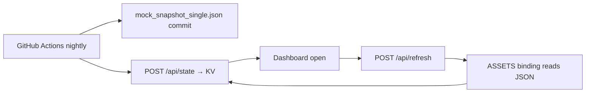

# Groundswell Dashboard Setup Walkthrough

**Dashboard:** https://groundswell-monitor.zh5779485.workers.dev/  
**Repo:** https://github.com/MastersX888/groundswell-monitor  
**GitHub secrets:** https://github.com/MastersX888/groundswell-monitor/settings/secrets/actions  
**Nightly workflow:** Actions → **Groundswell Daily Fetch** (cron 05:00 UTC / midnight CT)

---

## Prerequisites

| Item | Where / value |
|------|----------------|
| Cloudflare Access login | Your allowed email on the Worker app |
| GitHub repo access | `MastersX888/groundswell-monitor` (push to `main`) |
| Cloudflare zone analytics token | Zone **Analytics Read** + **Zone Read** for `jasoncholloway.com` |
| Zone ID (`CF_ZONE_TAG`) | Cloudflare → `jasoncholloway.com` → Overview → right sidebar |
| GSC property verified | `sc-domain:jasoncholloway.com` (author site — already verified per ops notes) |
| Worker deploy token | `CLOUDFLARE_API_TOKEN` (Workers Scripts Edit + KV Edit — separate from zone token) |

**How data flows:**



---

## 1. GSC Clicks / Impressions

### What the pipeline does

`pipeline/groundswell_fetch.py` calls the Search Console API for **yesterday (UTC)** and writes into each daily snapshot:

| Field | Meaning |
|-------|---------|
| `clicks` | Total GSC clicks that day (int, or `null` on failure) |
| `impr` | Total GSC impressions that day (int, or `null` on failure) |
| `queries` | Up to 25 rows: `{ "q", "clicks", "impressions" }` |
| `pages` | Up to 25 rows: `{ "page", "clicks", "impressions" }` |

The dashboard **SEO & Analytics** tab rolls up the last **30 days** of snapshots from KV (not just the single committed JSON file).

**Current state:** `public/mock_snapshot_single.json` shows `"clicks": null`, `"impr": null`, and no `queries`/`pages` — GSC auth is not wired in Actions yet.

### Exact GitHub secret name

**`GSC_SERVICE_ACCOUNT_JSON`** — paste the **entire** service-account JSON key file contents.

The workflow writes it to `./gsc-service-account.json` and sets `GSC_SERVICE_ACCOUNT_FILE=./gsc-service-account.json`.  
(Local dev uses the same file path per `.env.example`; the env var name there is `GSC_SERVICE_ACCOUNT_FILE`, not `GSC_SERVICE_ACCOUNT_JSON`.)

Optional override secret: **`GSC_SITE_URL`** (default: `sc-domain:jasoncholloway.com`).

### Step-by-step: Google service account

1. **Google Cloud Console:** https://console.cloud.google.com/  
   - Create or select a project (e.g. “Groundswell Monitor”).

2. **Enable API:** APIs & Services → Library → search **“Google Search Console API”** → Enable.  
   (API ID: `webmasters.googleapis.com`; scope used in code: `webmasters.readonly`.)

3. **Create service account:** IAM & Admin → Service Accounts → **Create**  
   - Name: e.g. `groundswell-gsc-reader`  
   - No special roles needed on the GCP project itself.

4. **Download JSON key:** Service account → Keys → Add key → JSON → download.

5. **Add to GitHub:**  
   https://github.com/MastersX888/groundswell-monitor/settings/secrets/actions  
   → New repository secret → Name: **`GSC_SERVICE_ACCOUNT_JSON`** → paste full JSON.

6. **Grant access in Search Console:** https://search.google.com/search-console  
   - Open property **`jasoncholloway.com`** (must be **Domain** type — not `https://jasoncholloway.com/` URL prefix)  
   - Settings → **Users and permissions** → **Add user**  
   - Email: **`groundswell-gsc-reader@groundswell-monitor.iam.gserviceaccount.com`**  
   - Permission: **Full** (or Restricted — both work for read-only API)  
   - **Common blocker:** Domain vs URL-prefix mismatch — Groundswell expects `sc-domain:jasoncholloway.com` (Domain property only)

7. **(Optional) Imprint property:** repeat step 6 for `sc-domain:seventhcitypress.com` if you add a second nightly job later. The pipeline currently reads **one** property via `GSC_SITE_URL`.

### `GSC_SITE_URL` format

| Property type in GSC | Value to use |
|---------------------|--------------|
| **Domain** (recommended) | `sc-domain:jasoncholloway.com` |
| URL-prefix (if you used that instead) | `https://jasoncholloway.com/` |

Default in workflow and `.env.example`: **`sc-domain:jasoncholloway.com`**.  
Do **not** omit the `sc-domain:` prefix for domain properties.

### What stays null until this works

| UI / field | Until GSC secret + SA user access |
|------------|-----------------------------------|
| Morning Brief → **GSC Clicks** | Shows `—` |
| Command funnel **Impressions / Clicks** | `0` or empty |
| **Top Search Queries** panel | “No search queries in this period.” |
| **Top Landing Pages** panel | “No GSC page data in snapshots yet.” |
| **Moment Pages vs Volume Pages** panel | All zeros (see §2) |
| Snapshot `clicks`, `impr` | `null` |
| Snapshot `queries`, `pages` | `[]` or missing |

---

## 2. GSC Panel WIP (Moment Pages vs Volume Pages)

### What the uncommitted changes do

**`public/index.html`** (not yet committed) adds a third SEO panel:

- **Moment Pages vs Volume Pages** — aggregates GSC **page** data over 30 days into three buckets:
  - **Moments:** URLs matching `/books/masters-x/moments/`
  - **Volumes:** `/books/masters-x/the-inheritance-of-frequency`, `the-grimoire`, `the-kingdom`
  - **Comp pages:** `/books/books-like-*`, `/books/literary-conspiracy*`

Each bucket shows total clicks, impressions, and URL count.

**Data source:** `pages[]` arrays inside daily snapshots (from GSC — same setup as §1). No separate API.

**`public/data/ops_rollups.json`** (also uncommitted) expands ops-board metadata (discovery audit, evening brief, pipeline source notes). The dashboard loads it on refresh via `src/refresh.js` → `/data/ops_rollups.json`.

### Must `ops_rollups.json` be committed?

**Yes**, if you want the live dashboard to show the updated Ops Board / pipeline-source notes.  
`refresh.js` reads the committed static file from Worker assets — uncommitted local changes are **not** on production until pushed.

The Moment panel lives in **`index.html`** — that must be committed too.

### Steps to commit and deploy

1. In `groundswell-monitor/` repo, stage and commit:
   - `public/index.html`
   - `public/data/ops_rollups.json` (if you want the ops updates)

2. Push to **`main`** on https://github.com/MastersX888/groundswell-monitor

3. **Deploy Worker** runs automatically on push when paths under `public/**` change (`.github/workflows/deploy.yml`).  
   Or manually: Actions → **Deploy Worker** → Run workflow.

4. Requires **`CLOUDFLARE_API_TOKEN`** in GitHub secrets (Workers deploy — see `DEPLOY.md`).

5. Open dashboard → click **⟳ Refresh** (or reload) to merge assets into KV.

### What stays empty until both GSC + deploy

| Piece | Missing |
|-------|---------|
| Panel visible | Commit + deploy `index.html` |
| Panel shows real numbers | §1 GSC working (`pages[]` populated nightly) |
| Ops Board rollup text | Commit `ops_rollups.json` |

---

## 3. GitHub Actions Secrets — Nightly KV Push

### How the pipeline uses each secret

From `groundswell_fetch.py` and `groundswell_fetch.yml`:

| Secret | Used for |
|--------|----------|
| **`TERMINAL_URL`** | Base URL (default `https://groundswell-monitor.zh5779485.workers.dev`). Pipeline **GET** `/api/state`, merge today’s snapshot, **POST** `/api/state` back to KV. |
| **`CF_ACCESS_CLIENT_ID`** | Header `CF-Access-Client-Id` — bypasses Cloudflare Access login page for server-to-server calls. |
| **`CF_ACCESS_CLIENT_SECRET`** | Header `CF-Access-Client-Secret` — paired with Client ID. |
| **`INGEST_TOKEN`** | Header `Authorization: Bearer …` on `/api/state` and `/api/intel` pushes (Worker enforces on `/api/intel`; recommended to set on Worker). |
| **`INTEL_ENDPOINT`** | POST confirmed Reddit/Bluesky mentions to `/api/intel` (default: `…/api/intel`). |

If **`TERMINAL_URL`** or Access headers fail, the workflow still commits `mock_snapshot_single.json` to git, but **KV is not updated** — you only get fresh data when you open the dashboard (refresh merges the git snapshot) or run a local rebuild script.

Worker endpoints (`src/index.js`):

- **`GET/POST /api/state`** — read/write KV key `dashboard-state`
- **`GET/POST /api/intel`** — read/write `intel[]` in same KV object

### ALL secrets for **Groundswell Daily Fetch**

| Secret | Required? | Default / notes |
|--------|-----------|-----------------|
| `GSC_SERVICE_ACCOUNT_JSON` | For GSC | Entire SA JSON |
| `GSC_SITE_URL` | Optional | `sc-domain:jasoncholloway.com` |
| `SITE_DOMAIN` | Optional | `jasoncholloway.com` |
| `CF_API_TOKEN` | For traffic | Zone Analytics Read token |
| `CF_ZONE_TAG` | For traffic | Zone ID |
| `WEB3FORMS_API_KEY` | For signups | `w3f_live_…` |
| `BLUESKY_HANDLE` | For Bluesky | e.g. `jasonhollowaykc.bsky.social` |
| `BLUESKY_APP_PASSWORD` | For Bluesky | App password, not main password |
| `REDDIT_CLIENT_ID` | For Reddit | Script app |
| `REDDIT_CLIENT_SECRET` | For Reddit | |
| `REDDIT_USERNAME` | For Reddit | |
| `REDDIT_PASSWORD` | For Reddit | |
| `APIFY_API_TOKEN` | Optional | Reddit fallback |
| `OUTSTAND_API_KEY` | For social block | Also set on Worker for approval queue |
| `INTEL_ENDPOINT` | Optional | Default Worker `/api/intel` URL |
| `TERMINAL_URL` | **For KV push** | Default Worker URL |
| `INGEST_TOKEN` | **For KV + intel auth** | Must match Worker secret |
| `CF_ACCESS_CLIENT_ID` | **For KV push** | Service token |
| `CF_ACCESS_CLIENT_SECRET` | **For KV push** | Service token |

**Separate secret (Deploy Worker workflow only):** `CLOUDFLARE_API_TOKEN`

### Step-by-step: Cloudflare Access service token (Actions → Worker)

1. **Cloudflare Zero Trust:** https://one.dash.cloudflare.com/  
   → **Access** → **Service auth** → **Service Tokens** → **Create Service Token**  
   - Name: e.g. `github-actions-groundswell`

2. Copy **Client ID** and **Client Secret** (secret shown once).

3. **Attach token to the app:** Access → **Applications** → select the **groundswell-monitor** application  
   → **Policies** → Add policy:  
   - Action: **Service Auth** / Include: **Service Token** → select the token you created  
   - Ensure it allows reach to the Worker hostname.

4. **GitHub secrets:**
   - `CF_ACCESS_CLIENT_ID` = Client ID  
   - `CF_ACCESS_CLIENT_SECRET` = Client Secret

### Step-by-step: `INGEST_TOKEN` (match Worker + GitHub)

1. Generate a long random string (password manager).

2. **On Worker** (local, with wrangler auth):
   ```powershell
   cd groundswell-monitor
   npx wrangler secret put INGEST_TOKEN
   ```
   Paste the same value when prompted.

3. **GitHub:** add secret **`INGEST_TOKEN`** with the identical value.

4. **`TERMINAL_URL`:** add secret **`TERMINAL_URL`** = `https://groundswell-monitor.zh5779485.workers.dev` (or rely on workflow default).

5. **`OUTSTAND_API_KEY`:** also run `npx wrangler secret put OUTSTAND_API_KEY` for dashboard approval-queue actions.

---

## Verification Checklist (run after setup)

### A. Trigger a manual fetch

1. https://github.com/MastersX888/groundswell-monitor/actions/workflows/groundswell_fetch.yml  
2. **Run workflow** → watch logs for:
   - No `Search Console: …` warnings
   - `Successfully pushed data to the Cloudflare Worker!` (not `Failed to automatically push to terminal`)
   - `[intel] pushed N mention(s)` (optional)

### B. Git commit on `main`

- New commit: `Automated data fetch: YYYY-MM-DD`
- File `public/mock_snapshot_single.json` has:
  - `"clicks": <number>` and `"impr": <number>` (not `null`)
  - `"queries": [ … ]` and `"pages": [ … ]` with data

### C. KV state (optional CLI)

```powershell
npx wrangler kv key get --namespace-id=6f0e96702c3d4da4ad652abd51b5d82e dashboard-state
```

Expect `"snapshots"` array with recent dates; latest entry should include non-null `clicks`/`impr` when GSC works.

### D. Dashboard UI

1. Open https://groundswell-monitor.zh5779485.workers.dev/ (CF Access login)
2. **Morning Brief** → **GSC Clicks** shows a number (not `—`)
3. **SEO & Analytics** tab:
   - Top Search Queries populated
   - Top Landing Pages populated
   - Moment Pages vs Volume Pages shows non-zero after deploy + GSC data
4. Status / refresh → “wire refreshed”; footer shows multiple snapshots over time
5. Click **⟳ Refresh** — no “snapshot unavailable” in notes

### E. Deploy (after committing panel)

- Actions → **Deploy Worker** green after `public/**` push
- Live site includes Moment panel HTML

---

## What Remains Null / Empty Until Each Step

| Step done | What unlocks |
|-----------|----------------|
| `CF_API_TOKEN` + `CF_ZONE_TAG` | `visitors`, `requests`, `cached`, `countries`; Traffic panel |
| `GSC_SERVICE_ACCOUNT_JSON` + SA added in GSC | `clicks`, `impr`, `queries`, `pages`; SEO panels; GSC KPI |
| `WEB3FORMS_API_KEY` | `signups`; Signups KPI |
| Reddit / Bluesky secrets | Term counts + `mentions[]` + intel wire |
| `OUTSTAND_API_KEY` | `social` block in snapshot + Morning Brief platforms |
| `TERMINAL_URL` + Access token + `INGEST_TOKEN` | Nightly **KV** update (not just git JSON) |
| Commit + deploy `index.html` | Moment vs Volume panel visible |
| Commit `ops_rollups.json` | Updated Ops Board metadata |
| `CLOUDFLARE_API_TOKEN` | CI deploy after public file changes |

---

## Suggested order for Jason

1. GSC service account + `GSC_SERVICE_ACCOUNT_JSON`
2. Access service token + `INGEST_TOKEN`
3. Run **Groundswell Daily Fetch** manually and verify
4. Commit/deploy the GSC panel changes

---

## Related docs

- `groundswell-monitor/.env.example` — local pipeline env template
- `groundswell-monitor/DEPLOY.md` — Worker deploy + `CLOUDFLARE_API_TOKEN`
- `scratch/ops_reports/packets/GSC_INDEXING_PHASE4_2026-08-07.md` — manual indexing / sitemap
- `scratch/ops_reports/groundswell/GROUNDSWELL_DASHBOARD_FIX_2026-08-09.md` — recent KV/Access diagnosis

*Morgan — setup walkthrough saved 2026-08-09.*
